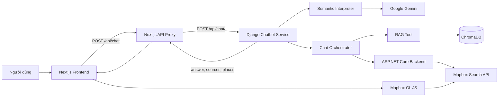
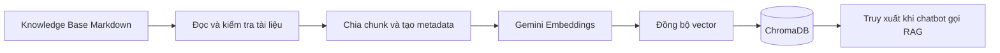
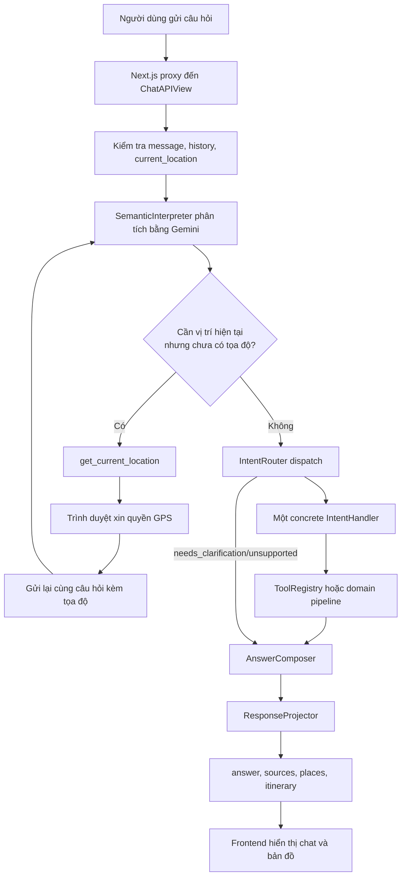
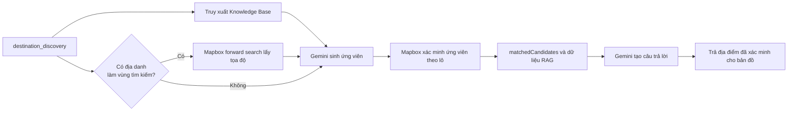
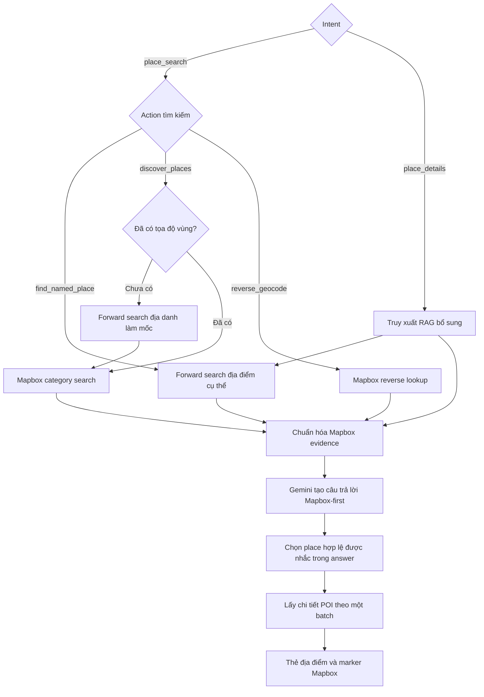
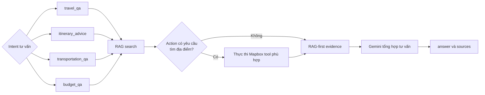
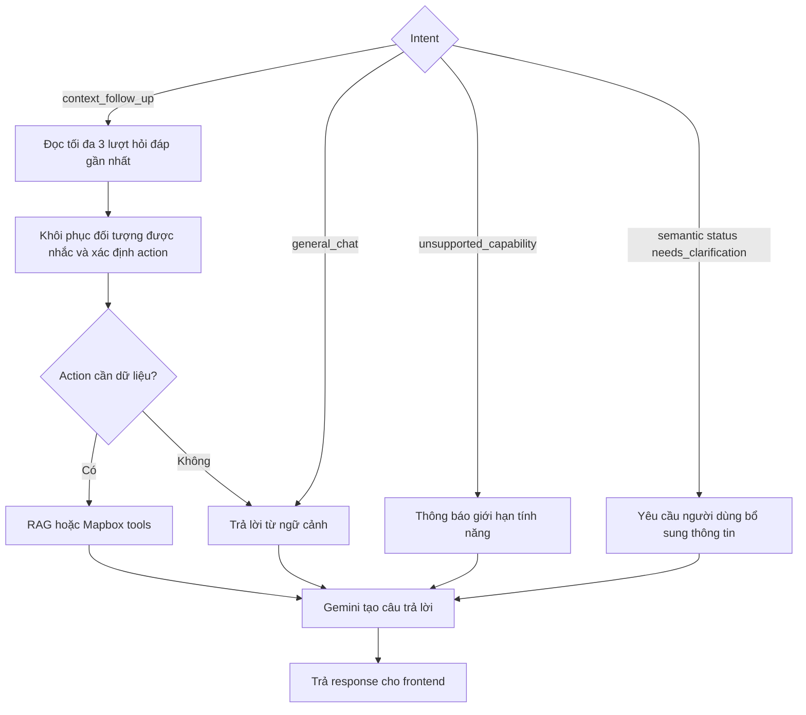
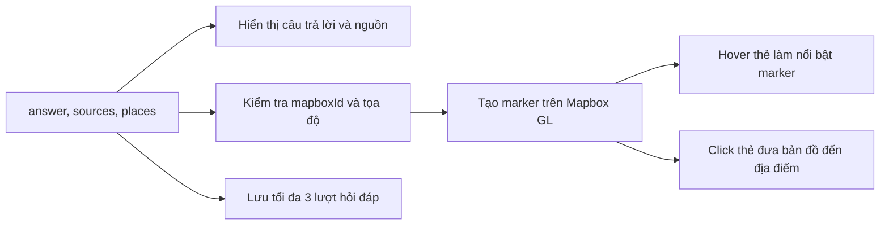

# Travel Chatbot

Travel Chatbot là hệ thống trợ lý du lịch Việt Nam kết hợp RAG, Google Gemini và
dữ liệu địa điểm từ Mapbox. Dự án gồm ba ứng dụng chính:

- `frontend`: giao diện người dùng và bản đồ.
- `chatbot_service`: chatbot, RAG và điều phối nghiệp vụ.
- `backend`: dịch vụ ASP.NET Core làm việc với Mapbox.

## Công nghệ sử dụng

| Thành phần | Công nghệ | Chức năng chính |
| --- | --- | --- |
| Frontend | Next.js 16, React 19, TypeScript, Tailwind CSS 4 | Giao diện chat, lịch sử hội thoại và API proxy |
| Bản đồ | Mapbox GL JS | Hiển thị vị trí người dùng và địa điểm được gợi ý |
| Chatbot service | Python, Django 5.2, Django REST Framework | Nhận request, phân tích câu hỏi và điều phối các công cụ |
| AI | Google Gemini, LangChain | Hiểu ý định, sinh ứng viên và tạo câu trả lời |
| RAG | LangChain, ChromaDB, Gemini Embeddings | Lập chỉ mục và truy xuất Knowledge Base |
| Backend | ASP.NET Core Web API, .NET 10 | Kiểm tra request, gọi và chuẩn hóa dữ liệu Mapbox |
| Dịch vụ ngoài | Google Gemini API, Mapbox Search API | Sinh nội dung, embedding, tìm kiếm và xác minh địa điểm |

## Kiến trúc hệ thống



### Frontend

`frontend` chạy tại `http://localhost:3000` và chịu trách nhiệm:

- Hiển thị giao diện chat, nguồn tham khảo và thông tin địa điểm.
- Gửi request qua Next.js API route thay vì gọi Django trực tiếp từ trình duyệt.
- Lưu tối đa ba lượt hỏi đáp gần nhất trong `localStorage`.
- Xin quyền truy cập GPS khi chatbot cần vị trí hiện tại.
- Hiển thị vị trí và marker địa điểm bằng Mapbox GL JS.

### Chatbot service

`chatbot_service` chạy tại `http://127.0.0.1:8000` và là tầng nghiệp vụ chính:

- Kiểm tra `message`, `history` và `current_location`.
- Dùng Gemini để xác định intent, action, địa danh và điều kiện tìm kiếm.
- Lập kế hoạch gọi RAG hoặc công cụ Mapbox theo allowlist.
- Thu thập bằng chứng rồi yêu cầu Gemini tạo câu trả lời cuối cùng.
- Trả về `answer`, `sources` và `places` cho frontend.

### Backend

`backend` chạy tại `http://localhost:5257` và cung cấp các typed API cho Django:

- Tìm địa điểm theo tên.
- Tìm địa điểm theo danh mục.
- Reverse geocoding từ tọa độ.
- Xác minh danh sách ứng viên địa điểm.
- Lấy chi tiết các POI theo lô.

Mapbox server token được giữ tại ASP.NET Core. Frontend chỉ sử dụng public token
để hiển thị bản đồ.

### Kho dữ liệu RAG

- Dữ liệu Markdown nằm trong `chatbot_service/chatbot/knowledge_base`.
- Vector được lưu cục bộ trong ChromaDB.
- Gemini Embeddings được dùng để tạo vector cho tài liệu và câu truy vấn.

## Các luồng hoạt động

### 1. Luồng khởi tạo Knowledge Base



Chạy lại `python manage.py ingest_knowledge` khi thêm, sửa hoặc xóa tài liệu.

### 2. Sơ đồ định tuyến tổng quát theo intent

Mỗi request chỉ có một `primary_intent`. `SemanticInterpreter` chỉ phân loại và
trích xuất semantic data; `IntentRouter` dispatch tới đúng một handler. Handler
tự lập plan, chạy tool/pipeline và gắn evidence policy.



12 handler được đăng ký tại `chatbot/intent_routing/factory.py`; registry kiểm tra
đủ và không trùng `TravelIntent` ngay khi khởi tạo. `ToolRegistry` vẫn là boundary
allowlist và typed validation duy nhất cho tool backend.

`chatbot.tool_planner.plan_tools()` và `response_policy_for()` chỉ còn là compatibility
facade cho test hoặc integration cũ; runtime request không đi qua hai API này. Có thể
xóa chúng sau khi toàn bộ consumer bên ngoài chuyển sang handler và policy tương ứng.

### 3. Intent `destination_discovery`

Dùng cho yêu cầu gợi ý hoặc so sánh điểm đến theo thời gian, sở thích, nhóm đi
và ngân sách.



### 4. Intent `place_search` và `place_details`

Hai intent này ưu tiên dữ liệu Mapbox. Knowledge Base chỉ bổ sung bối cảnh ổn
định và không thay thế dữ liệu địa điểm từ provider.



### 5. Nhóm intent tư vấn dựa trên RAG

Nhóm này gồm `travel_qa`, `itinerary_advice`, `transportation_qa` và
`budget_qa`. `itinerary_advice` chỉ tư vấn lịch trình dạng văn bản; hệ thống hiện
không lưu lịch trình hoặc tính route.



### 6. Intent phụ thuộc hội thoại và intent không dùng tool



`unsupported_capability` áp dụng cho yêu cầu chưa được hỗ trợ như chỉ đường trực
tiếp, giao thông thời gian thực hoặc lưu dữ liệu người dùng.

### 7. Luồng hiển thị kết quả trên frontend



Frontend không lưu tọa độ GPS chính xác vào `localStorage`.

## Yêu cầu

- Python 3 và `pip`.
- .NET 10 SDK.
- Node.js và npm.
- Gemini API key.
- Mapbox access token cho backend và public token cho frontend.

Không commit API key, access token hoặc file `.env` thật lên Git.

## Cài đặt và chạy dự án

Ba ứng dụng cần chạy trong ba cửa sổ PowerShell riêng.

### 1. ASP.NET Core Backend

Tại thư mục gốc `Travel-Chatbot`:

```powershell
dotnet user-secrets set "Mapbox:AccessToken" "your_server_mapbox_token" --project .\backend\backend\backend.csproj
dotnet run --project .\backend\backend\backend.csproj --launch-profile http
```

Backend chạy tại `http://localhost:5257`. Swagger UI có tại
`http://localhost:5257/swagger` trong môi trường Development.

### 2. Django Chatbot Service

```powershell
cd chatbot_service
python -m venv .venv
.\.venv\Scripts\Activate.ps1
python -m pip install -r requirements.txt
Copy-Item .env.example .env
```

Cấu hình `chatbot_service/.env`:

```env
GEMINI_API_KEY=your_gemini_api_key
GEMINI_EMBEDDING_MODEL=gemini-embedding-001
GEMINI_CHAT_MODEL=gemini-3.5-flash-lite
MAPBOX_TOOL_BASE_URL=http://localhost:5257
MAPBOX_TOOL_TIMEOUT_SECONDS=12
CHATBOT_MAX_TOOL_CALLS=8
```

Khởi tạo Knowledge Base và chạy Django:

```powershell
python manage.py ingest_knowledge
python manage.py runserver
```

API chat chạy tại `http://127.0.0.1:8000/api/chat/`.

### 3. Next.js Frontend

```powershell
cd frontend
npm install
Copy-Item .env.example .env
```

Cấu hình `frontend/.env`:

```env
BACKEND_URL=http://127.0.0.1:8000
DOTNET_BACKEND_URL=http://localhost:5257
NEXT_PUBLIC_MAPBOX_ACCESS_TOKEN=your_public_mapbox_token
```

Chạy frontend:

```powershell
npm run dev
```

Mở `http://localhost:3000` để sử dụng ứng dụng.

## Kiểm tra dự án

```powershell
dotnet test .\backend\backend.slnx

cd chatbot_service
python manage.py test

cd ..\frontend
npm run lint
npm run build
npm run test:e2e
```

`npm run test:e2e` tự khởi động một Next.js server riêng tại cổng `3100` và chạy
Playwright bằng Microsoft Edge Stable. Bộ E2E mock response Gemini/Mapbox để kiểm
tra ổn định luồng frontend; máy chạy test cần cài Microsoft Edge.

Các test cục bộ kiểm tra logic và contract của ứng dụng nhưng không thay thế kiểm
thử trực tiếp Gemini, Mapbox và kết nối mạng đến các nhà cung cấp.
