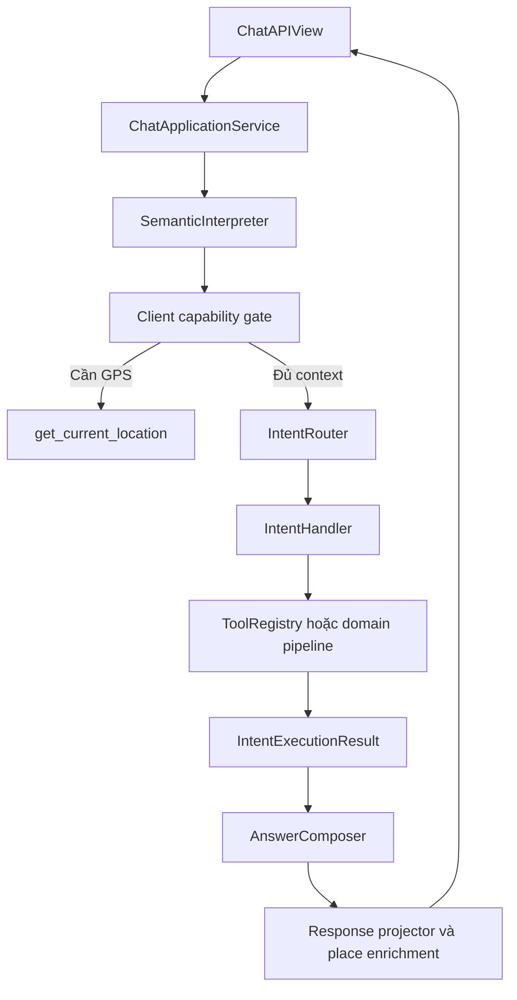

# Kế hoạch refactor Intent Router cho Travel Chatbot

## 1. Thông tin kế hoạch

- Phạm vi: `chatbot_service` trên nhánh `feature-recommendation`.
- Mốc mã nguồn đã phân tích: commit `5f6663eb594da9078820ac0b2b68d0b05ca23806`.
- Mục tiêu chính: làm rõ ranh giới giữa phân loại intent, định tuyến, xử lý nghiệp vụ, gọi tool và tổng hợp câu trả lời.
- Yêu cầu bắt buộc: mỗi `TravelIntent` có một handler nằm trong một file riêng.
- Nguyên tắc migration: giữ nguyên contract HTTP và hành vi hiện có trước khi tối ưu hoặc bổ sung tính năng.

## 2. Vấn đề của kiến trúc hiện tại

Luồng hiện tại đã có định tuyến theo intent nhưng trách nhiệm đang phân tán:

1. `semantic.py` dùng Gemini tạo `primary_intent`, `actions`, entities và status.
2. `tool_planner.py` vừa kiểm tra intent, vừa ánh xạ action, vừa quyết định tool.
3. `orchestrator.py` chứa các nhánh đặc biệt cho `destination_discovery`, `itinerary_making`, `itinerary_management` và nhánh chung cho các intent còn lại.
4. `response_policy.py` lại ánh xạ intent sang chính sách evidence ở một nơi khác.
5. `ChatOrchestrator.answer()` đồng thời làm semantic interpretation, kiểm tra GPS, định tuyến, thực thi tool, tạo prompt trả lời, thu thập source, lọc place và enrich place.

Hệ quả:

- Muốn thêm hoặc sửa một intent phải thay đổi nhiều file và nhiều bảng ánh xạ.
- Khó nhìn toàn bộ luồng của một intent từ đầu đến cuối.
- `ChatOrchestrator` ngày càng lớn và có nhiều lý do để thay đổi.
- Có nguy cơ thêm intent vào `TravelIntent` nhưng quên đăng ký tool plan, response policy hoặc pipeline.
- Unit test của từng intent khó cô lập khỏi orchestrator chung.

## 3. Mục tiêu và ngoài phạm vi

### 3.1. Mục tiêu

- Tạo một `IntentRouter` rõ ràng, chỉ làm nhiệm vụ chọn handler từ `primary_intent`.
- Mỗi intent có một file handler riêng.
- Mỗi handler sở hữu luồng nghiệp vụ của intent: lập tool plan, chạy pipeline và chọn response policy.
- Các thao tác dùng chung như execute tool, kiểm tra tool budget và tạo kết quả chuẩn được tái sử dụng, không copy-paste.
- `ChatOrchestrator` trở thành application service mỏng điều phối các bước cấp cao.
- Không để Gemini tự gọi tùy ý tên tool; backend tiếp tục kiểm soát bằng `ToolRegistry` và typed input.
- Có kiểm tra fail-fast khi thiếu hoặc đăng ký trùng handler.
- Giữ nguyên response của `POST /api/chat/` cho frontend.

### 3.2. Ngoài phạm vi

- Không chuyển sang multi-agent hoặc LangGraph trong đợt refactor này.
- Không thay đổi model Gemini, embedding, ChromaDB hay API Mapbox.
- Không thay đổi taxonomy 12 intent trong khi refactor.
- Không thay đổi contract itinerary hoặc cấu trúc database.
- Không tối ưu prompt/classification accuracy cùng lúc với thay đổi kiến trúc.

## 4. Quyết định kiến trúc

### 4.1. Phân biệt Intent Classifier và Intent Router

`SemanticInterpreter` hiện tại thực chất là **Intent Classifier + semantic extractor**. Thành phần này tiếp tục:

- nhận question, history, current location và active itinerary;
- gọi Gemini structured output;
- trả về `SemanticInterpretation` đã được Pydantic validate.

`IntentRouter` mới **không gọi Gemini và không phân loại lại**. Router chỉ nhận `SemanticInterpretation.primary_intent`, lấy đúng handler từ registry và dispatch.

Việc tách hai khái niệm này tránh cho router vừa phụ thuộc LLM vừa chứa logic nghiệp vụ.

### 4.2. Luồng mục tiêu



### 4.3. Ranh giới trách nhiệm

| Thành phần | Trách nhiệm | Không chịu trách nhiệm |
| --- | --- | --- |
| `SemanticInterpreter` | Phân loại intent và trích xuất semantic data | Chọn handler, gọi business tool |
| `ClientCapabilityGate` | Kiểm tra nhu cầu GPS hoặc capability phía client | Xử lý intent |
| `IntentRouter` | Tìm và gọi đúng handler | Lập tool plan, chứa `if/elif` nghiệp vụ |
| `IntentHandler` | Xử lý một intent, lập plan và chạy pipeline | Tổng hợp HTTP response |
| `ToolRegistry` | Validate và thực thi tool nằm trong allowlist | Phân loại intent |
| `AnswerComposer` | Tạo prompt từ evidence và gọi Gemini trả lời cuối | Quyết định tool |
| `ResponseProjector` | Sources, places, itinerary và enrichment | Business routing |

## 5. Cấu trúc thư mục đề xuất

```text
chatbot_service/chatbot/
├── intent.py                         # Giữ enum TravelIntent và description
├── semantic.py                       # SemanticInterpreter/semantic schema
├── orchestrator.py                   # Application service mỏng
├── answer_composer.py                # Tách logic tạo final answer
├── response_projector.py             # Sources, places, enrichment
├── intent_routing/
│   ├── __init__.py
│   ├── contracts.py                  # IntentContext, IntentExecutionResult, protocol
│   ├── router.py                     # IntentRouter: lookup và dispatch
│   ├── factory.py                    # Wiring dependency và đăng ký đủ 12 handler
│   ├── exceptions.py                 # Missing/Duplicate handler errors
│   ├── execution.py                  # Shared deterministic tool executor
│   ├── planning.py                   # Helper tạo tool call, không branch theo intent
│   └── handlers/
│       ├── __init__.py
│       ├── base.py                   # Base/shared behavior, không chứa intent switch
│       ├── destination_discovery.py
│       ├── place_search.py
│       ├── place_details.py
│       ├── travel_qa.py
│       ├── itinerary_making.py
│       ├── itinerary_management.py
│       ├── itinerary_advice.py
│       ├── transportation_qa.py
│       ├── budget_qa.py
│       ├── context_follow_up.py
│       ├── general_chat.py
│       └── unsupported_capability.py
└── tests/
    └── intent_routing/
        ├── test_router.py
        ├── test_factory.py
        ├── test_destination_discovery_handler.py
        ├── test_place_search_handler.py
        ├── test_place_details_handler.py
        ├── test_travel_qa_handler.py
        ├── test_itinerary_making_handler.py
        ├── test_itinerary_management_handler.py
        ├── test_itinerary_advice_handler.py
        ├── test_transportation_qa_handler.py
        ├── test_budget_qa_handler.py
        ├── test_context_follow_up_handler.py
        ├── test_general_chat_handler.py
        └── test_unsupported_capability_handler.py
```

Lưu ý: `destination_discovery.py`, `itinerary_making.py` và `itinerary_management.py` hiện tại là domain pipeline. Trong giai đoạn đầu có thể giữ nguyên ba file này; các handler mới chỉ gọi pipeline tương ứng. Không nên chuyển toàn bộ pipeline vào handler vì sẽ làm handler quá lớn.

## 6. Contract cốt lõi

### 6.1. IntentContext

Context là input bất biến truyền vào handler:

```python
@dataclass(frozen=True)
class IntentContext:
    question: str
    history: tuple[ConversationMessage, ...]
    interpretation: SemanticInterpretation
    current_location: SemanticLocation | None
    active_itinerary_id: str | None
    active_itinerary_version: int | None
```

Không đặt `ToolRegistry`, model hoặc service dependency vào context. Dependency được inject qua constructor của handler để tránh biến context thành service locator.

### 6.2. IntentExecutionResult

Mọi handler trả cùng một kiểu kết quả:

```python
@dataclass(frozen=True)
class IntentExecutionResult:
    planned_calls: tuple[PlannedToolCall, ...] = ()
    executions: tuple[ToolExecution, ...] = ()
    response_policy: str | None = None
    destination_evidence: dict[str, Any] | None = None
    itinerary_evidence: dict[str, Any] | None = None
    itinerary: ItineraryMakingData | ItineraryData | None = None
    itinerary_operation: dict[str, Any] | None = None
```

`AnswerComposer` chỉ đọc contract này, không cần biết handler cụ thể nào đã chạy.

### 6.3. IntentHandler protocol

```python
class IntentHandler(Protocol):
    intent: TravelIntent

    def handle(self, context: IntentContext) -> IntentExecutionResult:
        ...
```

### 6.4. IntentRouter

```python
class IntentRouter:
    def __init__(self, handlers: Sequence[IntentHandler]) -> None:
        self._handlers = build_validated_handler_map(handlers)

    def dispatch(self, context: IntentContext) -> IntentExecutionResult:
        handler = self._handlers[context.interpretation.primary_intent]
        return handler.handle(context)
```

Router constructor phải kiểm tra:

- không có hai handler cho cùng một intent;
- tập intent đã đăng ký bằng chính xác `set(TravelIntent)`;
- thông báo rõ intent nào đang thiếu hoặc bị trùng;
- registry bất biến sau khi khởi tạo.

## 7. Luồng xử lý của từng intent

| Intent | File handler | Luồng xử lý chính | Evidence/policy |
| --- | --- | --- | --- |
| `destination_discovery` | `handlers/destination_discovery.py` | Tạo RAG/Mapbox plan, chạy `DestinationDiscoveryPipeline`, xác minh candidates | Destination discovery policy |
| `place_search` | `handlers/place_search.py` | Resolve anchor nếu cần, category/named-place search, execute Mapbox plan | Mapbox-first |
| `place_details` | `handlers/place_details.py` | RAG cho bối cảnh ổn định và Mapbox cho dữ liệu POI cụ thể | Mapbox-first |
| `travel_qa` | `handlers/travel_qa.py` | Tìm knowledge base theo normalized query | RAG-first advice |
| `itinerary_making` | `handlers/itinerary_making.py` | Tạo tool plan, tìm/xác minh stops, optimize route, persist qua `ItineraryMakingPipeline` | Verified itinerary policy |
| `itinerary_management` | `handlers/itinerary_management.py` | Validate active itinerary/version, chạy `ItineraryManagementPipeline` | Itinerary management policy |
| `itinerary_advice` | `handlers/itinerary_advice.py` | RAG/context-based advice, không mutate itinerary hoặc tự tạo route | RAG-first advice |
| `transportation_qa` | `handlers/transportation_qa.py` | RAG/context cho tư vấn phương tiện và di chuyển hiện được hỗ trợ | RAG-first advice |
| `budget_qa` | `handlers/budget_qa.py` | RAG/context cho tư vấn hoặc ước tính chi phí | RAG-first advice |
| `context_follow_up` | `handlers/context_follow_up.py` | Dùng entities/actions đã resolve từ history; chỉ gọi tool khi action yêu cầu | Policy tùy evidence thực tế hoặc no-tool |
| `general_chat` | `handlers/general_chat.py` | Không gọi tool, chuyển thẳng sang answer composer | No-tool context |
| `unsupported_capability` | `handlers/unsupported_capability.py` | Không gọi provider tool, giải thích giới hạn an toàn | Unsupported/no-tool policy |

### Quy tắc dùng chung cho tất cả handler

- Nếu semantic status là `needs_clarification` hoặc `unsupported`, không chạy provider tool.
- Không handler nào tự gọi HTTP Mapbox; mọi lời gọi phải đi qua `ToolRegistry` hoặc domain pipeline sử dụng registry.
- Áp dụng `CHATBOT_MAX_TOOL_CALLS` trước khi execute.
- Tool plan phải deterministic từ semantic output đã validate.
- Không tự tạo Mapbox ID, tọa độ, route geometry, rating hoặc opening hours.
- Handler không tạo `Response` của Django và không biết HTTP status code.

## 8. Tách `tool_planner.py` hiện tại

Không nên giữ một hàm `plan_tools()` lớn tiếp tục branch theo `TravelIntent`, vì khi đó logic intent vẫn nằm ngoài handler.

Refactor theo hai lớp:

1. `intent_routing/planning.py` chỉ chứa helper nhỏ, tái sử dụng được:
   - `plan_rag_search(...)`
   - `plan_destination_lookup(...)`
   - `plan_named_place_search(...)`
   - `plan_category_search(...)`
   - `plan_reverse_lookup(...)`
   - `deduplicate_calls(...)`
2. Mỗi handler tự compose các helper cần thiết cho intent của nó.

Trong thời gian migration có thể giữ `tool_planner.plan_tools()` làm compatibility wrapper. Sau khi toàn bộ handler đã dùng helper mới và test đạt, xóa wrapper cùng các nhánh intent cũ.

## 9. Tách `response_policy.py`

Giữ nội dung policy dưới dạng constants dùng chung, nhưng bỏ dần hàm trung tâm `response_policy_for(intent)`.

Mỗi handler gắn policy phù hợp vào `IntentExecutionResult.response_policy`. Nhờ vậy toàn bộ quyết định của một intent có thể đọc từ file handler của intent đó, và `AnswerComposer` không cần switch theo `TravelIntent` lần nữa.

## 10. Kế hoạch triển khai theo giai đoạn

### Giai đoạn 0 — Khóa hành vi hiện tại

Thời lượng dự kiến: 0.5–1 ngày.

Việc thực hiện:

- Chạy toàn bộ unit test Django hiện có và lưu baseline.
- Bổ sung characterization tests cho response/result của 12 intent bằng mock Gemini và mock tool registry.
- Tạo fixture tối thiểu cho:
  - một request thành công;
  - `needs_clarification`;
  - `unsupported`;
  - thiếu GPS và trả `client_tool_call`;
  - toàn bộ tool gặp infrastructure failure.
- Khóa contract API: `answer`, `sources`, `places`, `itinerary`, `itineraryOperation` và `client_tool_call`.

Kết quả: có safety net để chứng minh refactor không đổi hành vi ngoài ý muốn.

### Giai đoạn 1 — Tạo contract và Router core

Thời lượng dự kiến: 0.5–1 ngày.

Việc thực hiện:

- Tạo `IntentContext`, `IntentExecutionResult`, `IntentHandler`.
- Tạo `IntentRouter`, exception và handler registry validation.
- Tạo `factory.py` để wire dependency tại composition root.
- Viết test duplicate handler, missing handler, exact coverage và correct dispatch.

Kết quả: router độc lập, test được mà không cần Django hoặc Gemini thật.

### Giai đoạn 2 — Tách các handler đơn giản

Thời lượng dự kiến: 1–1.5 ngày.

Thứ tự đề xuất:

1. `general_chat`
2. `unsupported_capability`
3. `travel_qa`
4. `itinerary_advice`
5. `transportation_qa`
6. `budget_qa`
7. `context_follow_up`

Việc thực hiện:

- Di chuyển tool planning/policy tương ứng vào handler.
- Tạo base helper cho nhóm RAG-first nhưng vẫn giữ một file concrete cho từng intent.
- Không dùng một handler chung đăng ký cho nhiều intent; mỗi concrete handler phải khai báo đúng một `intent`.
- Viết unit test riêng cho từng handler.

Kết quả: các intent no-tool và RAG-first không còn phụ thuộc nhánh intent trong orchestrator.

### Giai đoạn 3 — Tách các handler Mapbox và pipeline đặc biệt

Thời lượng dự kiến: 1.5–2.5 ngày.

Thứ tự đề xuất:

1. `place_search`
2. `place_details`
3. `destination_discovery`
4. `itinerary_making`
5. `itinerary_management`

Việc thực hiện:

- Tách resolve destination, named-place, category và reverse planning thành helper nhỏ.
- Handler `destination_discovery` gọi pipeline hiện có và map kết quả sang `IntentExecutionResult`.
- Handler `itinerary_making` giữ tool budget, verification, optimization và persistence hiện tại.
- Handler `itinerary_management` giữ optimistic version/active itinerary contract hiện tại.
- Viết test success, partial data, provider failure, tool budget và invalid itinerary context.

Kết quả: toàn bộ 12 intent đã có concrete handler riêng.

### Giai đoạn 4 — Kết nối Router và làm mỏng Orchestrator

Thời lượng dự kiến: 1–1.5 ngày.

`ChatOrchestrator.answer()` sau refactor chỉ còn các bước:

1. Validate question.
2. Gọi `SemanticInterpreter`.
3. Kiểm tra client capability/GPS.
4. Tạo `IntentContext`.
5. Gọi `IntentRouter.dispatch()`.
6. Áp dụng infrastructure failure guard.
7. Gọi `AnswerComposer`.
8. Gọi `ResponseProjector` và trả `ChatOrchestratorResult`.

Xóa chuỗi `if/elif interpretation.primary_intent` khỏi orchestrator. Dependency được tạo tại `orchestrate_chat()`/factory và inject vào router/handler.

Kết quả: application service không còn biết chi tiết xử lý của từng intent.

### Giai đoạn 5 — Cleanup, observability và tài liệu

Thời lượng dự kiến: 0.5–1 ngày.

Việc thực hiện:

- Xóa compatibility wrapper và code chết trong `tool_planner.py`.
- Bỏ mapping intent trung tâm trong `response_policy_for()` nếu không còn consumer.
- Chuyển các helper tạo answer/place/source ra khỏi orchestrator.
- Thêm structured log tối thiểu:
  - `primary_intent`;
  - semantic `status`;
  - handler class;
  - planned tool names và tool count;
  - handler duration;
  - success/failure category, không log tọa độ nhạy cảm.
- Cập nhật README và sơ đồ kiến trúc.
- Chạy toàn bộ test/lint liên quan.

Kết quả: kiến trúc sạch, quan sát được và không còn hai đường routing song song.

## 11. Chiến lược test

### 11.1. Router tests

- Dispatch đúng handler cho cả 12 `TravelIntent`.
- Fail-fast khi thiếu handler.
- Fail-fast khi duplicate handler.
- Không có default handler âm thầm nuốt intent mới.
- `set(registered_intents) == set(TravelIntent)`.

### 11.2. Handler tests

Mỗi file handler cần kiểm tra:

- tool plan đúng với semantic action;
- không gọi tool khi status cần làm rõ/unsupported;
- tool call không vượt max budget;
- policy đúng;
- map đúng executions/evidence vào `IntentExecutionResult`;
- provider failure không làm handler tạo dữ liệu giả.

### 11.3. Integration tests

- `ChatOrchestrator` dùng mocked `SemanticInterpreter` và mocked registry.
- So sánh kết quả trước/sau refactor cho bộ fixture đại diện.
- Kiểm tra GPS retry flow.
- Kiểm tra destination discovery, itinerary making và itinerary management end-to-end ở service level.
- Kiểm tra final answer chỉ dùng verified places.

### 11.4. API regression tests

- Request/response của `ChatAPIView` không đổi.
- HTTP 422 vẫn dành cho semantic output không hợp lệ theo contract hiện tại.
- HTTP 503 vẫn dành cho infrastructure failure thực sự.
- Không chạy Playwright trừ khi có thay đổi hành vi quan sát được ở frontend hoặc được yêu cầu rõ ràng.

Lệnh kiểm tra dự kiến:

```bash
cd chatbot_service
python manage.py test chatbot.tests
```

Nếu dự án bổ sung formatter/linter trong quá trình triển khai, chạy thêm công cụ được cấu hình trong repo; không tự đưa formatter mới vào chỉ để phục vụ refactor.

## 12. Definition of Done

Refactor hoàn thành khi đạt tất cả điều kiện:

- Có đúng 12 concrete handler file tương ứng 12 `TravelIntent`.
- `IntentRouter` đăng ký đủ và chỉ đủ 12 intent.
- `ChatOrchestrator` không còn branch nghiệp vụ theo `primary_intent`.
- Global tool planner không còn quyết định toàn bộ luồng bằng `TravelIntent`.
- Mỗi handler tự khai báo response policy hoặc no-tool policy.
- Gemini chỉ tạo semantic structured output và final answer; không trực tiếp chọn tool ngoài allowlist.
- `CHATBOT_MAX_TOOL_CALLS` tiếp tục được áp dụng.
- Contract `ChatAPIView` và frontend không thay đổi.
- Destination discovery, itinerary making và itinerary management giữ nguyên verification/persistence semantics.
- Unit và integration tests liên quan đều pass.
- README mô tả đúng classifier → router → handler → tool/pipeline → composer.

## 13. Rủi ro và cách kiểm soát

| Rủi ro | Ảnh hưởng | Cách kiểm soát |
| --- | --- | --- |
| Refactor đồng thời đổi behavior | Khó biết lỗi do kiến trúc hay nghiệp vụ | Khóa behavior bằng characterization tests, không sửa prompt trong cùng PR |
| Lặp code giữa các handler RAG-first | Tăng chi phí bảo trì | Dùng base/helper, nhưng vẫn giữ concrete handler file cho từng intent |
| Handler registry thiếu intent mới | Runtime error | Validate exact enum coverage khi khởi tạo và có contract test |
| Logic vẫn phân tán ở planner/policy | Router mới nhưng kiến trúc không sạch | Chuyển composition decision vào handler, helper chỉ làm tác vụ nhỏ |
| Handler nhận quá nhiều dependency | Constructor lớn, khó test | Chỉ inject dependency cần thiết cho từng handler; factory chịu trách nhiệm wiring |
| Sai khác response sau khi tách composer | Frontend bị lỗi | Giữ `ChatOrchestratorResult` và API regression fixtures |
| Itinerary flow bị mất tool budget/version guard | Route hoặc dữ liệu không nhất quán | Test riêng budget, optimization match, active version và persistence failure |

## 14. Cách chia pull request/commit

Không nên thực hiện toàn bộ trong một commit lớn. Cách chia đề xuất:

1. `test: add intent routing characterization coverage`
2. `refactor: add intent router contracts and registry`
3. `refactor: extract no-tool and rag intent handlers`
4. `refactor: extract mapbox intent handlers`
5. `refactor: extract destination and itinerary handlers`
6. `refactor: route orchestrator through intent router`
7. `refactor: extract answer composer and response projector`
8. `docs: document intent router architecture`

Mỗi commit phải pass test liên quan. Không xóa đường xử lý cũ trước khi handler thay thế có coverage tương đương.

## 15. Ước lượng tổng thể

| Hạng mục | Ước lượng |
| --- | ---: |
| Baseline và characterization tests | 0.5–1 ngày |
| Router contracts, registry và factory | 0.5–1 ngày |
| 7 handler đơn giản | 1–1.5 ngày |
| 5 handler Mapbox/pipeline | 1.5–2.5 ngày |
| Làm mỏng orchestrator và tách composer/projector | 1–1.5 ngày |
| Cleanup, regression và tài liệu | 0.5–1 ngày |
| **Tổng** | **5–8.5 ngày làm việc** |

Ước lượng trên dành cho một developer đã hiểu codebase và đã có test mocks. Nếu characterization test hiện tại chưa đủ ổn định, nên ưu tiên chất lượng safety net thay vì ép thời gian refactor.

## 16. Thứ tự ưu tiên thực thi cho Codex

Khi giao kế hoạch này cho Codex, yêu cầu triển khai tuần tự:

1. Đọc `AGENTS.md` và các file semantic/orchestrator/tool planner/pipeline hiện tại.
2. Chạy baseline tests, không sửa code khi chưa ghi nhận failure sẵn có.
3. Thêm characterization tests.
4. Tạo contracts/router/registry và test.
5. Tách handler theo thứ tự rủi ro thấp đến cao.
6. Chỉ chuyển orchestrator sang router sau khi đủ 12 handler.
7. Xóa code cũ sau khi regression tests pass.
8. Báo rõ file thay đổi, test đã chạy, failure có sẵn và phần chưa làm.

